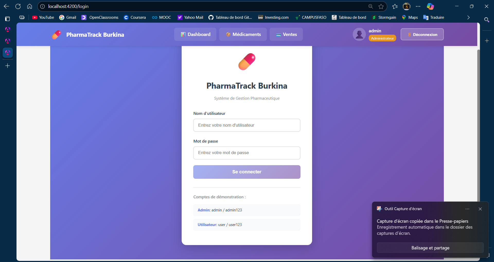
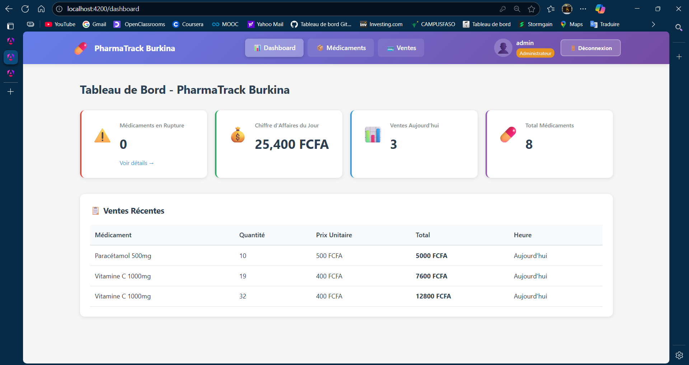
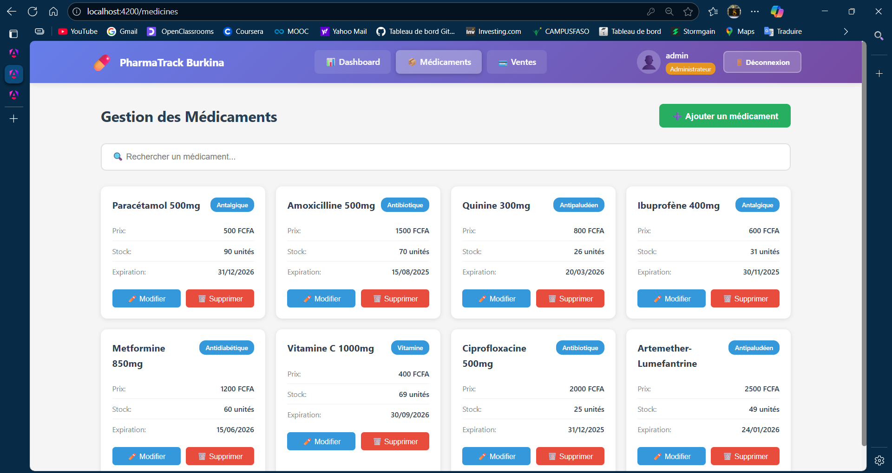
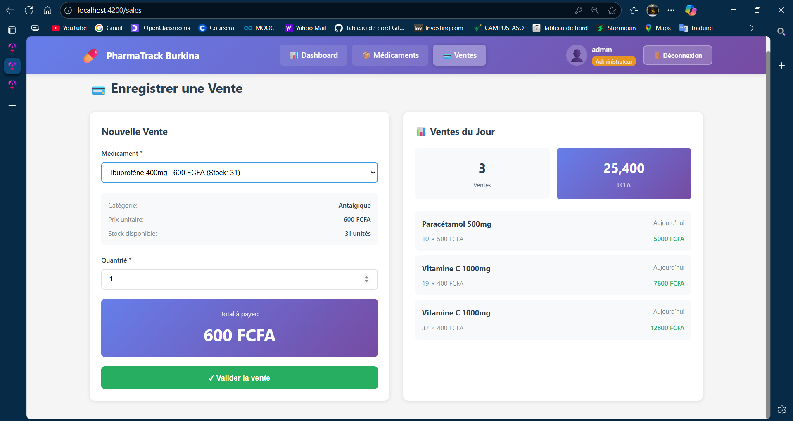

# 💊 PharmaTrack Burkina

Application de gestion pharmaceutique pour les petites pharmacies et dépôts pharmaceutiques au Burkina Faso.

## 📋 Description

PharmaTrack est une application web Angular permettant de gérer efficacement :
- 📦 Le stock de médicaments
- 💳 Les ventes quotidiennes
- ⚠️ Les alertes de rupture de stock
- 📊 Les statistiques et tableaux de bord

## 🚀 Installation

### Prérequis
- Node.js (version 18 ou supérieure)
- npm (version 9 ou supérieure)
- Angular CLI

### Étapes d'installation

1. **Cloner le projet**
```bash
git clone <votre-repo>
cd pharmatrack-burkina
```

2. **Installer les dépendances**
```bash
npm install
```

3. **Installer concurrently (pour lancer app et API en même temps)**
```bash
npm install --save-dev concurrently
```

## 🏃 Lancer l'application

### Option 1 : Tout lancer en même temps (Recommandé)
```bash
npm run dev
```
Cette commande lance simultanément :
- L'application Angular sur http://localhost:4200
- Le serveur JSON sur http://localhost:3000

### Option 2 : Lancer séparément

**Terminal 1 - Serveur JSON :**
```bash
npm run api
```

**Terminal 2 - Application Angular :**
```bash
npm start
```

## 👤 Connexion

L'application contient deux comptes de démonstration :

### Administrateur
- **Identifiant :** admin
- **Mot de passe :** admin123
- **Droits :** Gestion complète (CRUD médicaments + ventes)

### Utilisateur
- **Identifiant :** user
- **Mot de passe :** user123
- **Droits :** Consultation + enregistrement des ventes

## 📁 Structure du projet

```
src/
├── app/
│   ├── components/
│   │   ├── navbar/              # Barre de navigation
│   │   ├── login/               # Page de connexion
│   │   ├── dashboard/           # Tableau de bord
│   │   ├── medicines/           # Gestion des médicaments
│   │   │   └── medicine-list/
│   │   └── sales/               # Gestion des ventes
│   │       └── sale-form/
│   ├── models/                  # Interfaces TypeScript
│   │   ├── medicine.model.ts
│   │   ├── sale.model.ts
│   │   └── user.model.ts
│   ├── services/                # Services Angular
│   │   ├── auth.service.ts
│   │   ├── medicine.service.ts
│   │   └── sale.service.ts
│   ├── guards/                  # Guards de protection
│   │   └── auth.guard.ts
│   ├── interceptors/            # Intercepteurs HTTP
│   │   └── auth.interceptor.ts
│   ├── app.component.ts
│   ├── app.routes.ts
│   └── app.config.ts
├── db.json                      # Base de données JSON
└── styles.css                   # Styles globaux
```

## 🎯 Fonctionnalités

### 1. Dashboard 📊
- Vue d'ensemble des statistiques
- Alertes de rupture de stock
- Chiffre d'affaires du jour
- Nombre de ventes
- Liste des médicaments en stock faible

### 2. Gestion des Médicaments 📦
- Liste complète avec recherche et filtres
- CRUD complet (Administrateur uniquement)
- Alertes automatiques (stock < 10)
- Validation des formulaires :
  - Nom obligatoire
  - Prix > 0
  - Date d'expiration valide

### 3. Ventes 💳
- Enregistrement rapide des ventes
- Décrémentation automatique du stock
- Historique des ventes du jour
- Calcul automatique du total
- Statistiques en temps réel

### 4. Authentification 🔐
- Connexion sécurisée
- Guard de protection des routes
- Interceptor HTTP avec token
- Gestion des rôles (Admin/Utilisateur)

## 🔧 Technologies utilisées

- **Framework :** Angular 18 (Standalone Components)
- **Styling :** CSS personnalisé
- **Backend Mock :** JSON Server
- **HTTP Client :** Angular HttpClient
- **Routing :** Angular Router
- **Forms :** Reactive Forms + Template-driven Forms
- **State Management :** RxJS + Services

## 📝 API Endpoints

### Médicaments
- `GET /medicines` - Liste tous les médicaments
- `GET /medicines/:id` - Détails d'un médicament
- `POST /medicines` - Ajouter un médicament
- `PUT /medicines/:id` - Modifier un médicament
- `DELETE /medicines/:id` - Supprimer un médicament
- `GET /medicines?quantity_lte=10` - Médicaments en stock faible

### Ventes
- `GET /sales` - Liste toutes les ventes
- `GET /sales/:id` - Détails d'une vente
- `POST /sales` - Enregistrer une vente
- `GET /sales?date=YYYY-MM-DD` - Ventes d'une date

### Utilisateurs
- `GET /users` - Liste des utilisateurs (pour authentification)

## 🎨 Captures d'écran

### Page de Connexion


### Dashboard


### Gestion des Médicaments


### Enregistrement des Ventes


## 🛠️ Développement

### Générer de nouveaux composants
```bash
ng generate component components/nom-composant
```

### Générer un service
```bash
ng generate service services/nom-service
```

### Générer un guard
```bash
ng generate guard guards/nom-guard
```

### Build de production
```bash
ng build --configuration production
```

Les fichiers seront générés dans le dossier `dist/`

## 🧪 Tests

### Lancer les tests unitaires
```bash
ng test
```

### Lancer les tests e2e
```bash
ng e2e
```

## 📦 Déploiement

### Build de production
```bash
ng build --prod
```

### Servir les fichiers statiques
Vous pouvez déployer le contenu du dossier `dist/` sur :
- GitHub Pages
- Netlify
- Vercel
- Firebase Hosting
- Tout serveur web supportant les SPA

### Configuration serveur pour SPA
Assurez-vous que votre serveur redirige toutes les routes vers `index.html`

**Exemple nginx :**
```nginx
location / {
  try_files $uri $uri/ /index.html;
}
```

## 🔒 Sécurité

⚠️ **Note importante :** Cette application utilise une authentification simplifiée à des fins de démonstration.

Pour une utilisation en production :
1. Implémenter un backend réel avec authentification JWT
2. Hasher les mots de passe (bcrypt)
3. Utiliser HTTPS
4. Implémenter des validations côté serveur
5. Ajouter une gestion des sessions
6. Mettre en place des logs d'audit

## 📱 Responsive Design

L'application est entièrement responsive et s'adapte à :
- 💻 Desktop (1920px et +)
- 💻 Laptop (1024px - 1920px)
- 📱 Tablette (768px - 1024px)
- 📱 Mobile (320px - 768px)

## 🌍 Localisation

L'application est actuellement en français. Pour ajouter d'autres langues :
1. Installer `@angular/localize`
2. Configurer les traductions dans `angular.json`
3. Créer les fichiers de traduction

## ⚡ Performance

### Optimisations implémentées
- Lazy Loading des modules
- OnPush Change Detection (où applicable)
- Pure Pipes
- TrackBy dans les ngFor
- Standalone Components (réduction de la taille du bundle)

### Métriques cibles
- First Contentful Paint < 1.5s
- Time to Interactive < 3s
- Lighthouse Score > 90

## 🐛 Debugging

### Mode développement
```bash
ng serve --configuration development
```

### Activer les Source Maps
Les source maps sont activés par défaut en mode développement

### Angular DevTools
Installer l'extension Chrome : [Angular DevTools](https://chrome.google.com/webstore/detail/angular-devtools/ienfalfjdbdpebioblfackkekamfmbnh)

## 📚 Ressources

- [Documentation Angular](https://angular.dev)
- [Angular CLI](https://angular.io/cli)
- [RxJS](https://rxjs.dev/)
- [JSON Server](https://github.com/typicode/json-server)

## 🤝 Contribution

Les contributions sont les bienvenues !

1. Fork le projet
2. Créer une branche (`git checkout -b feature/AmazingFeature`)
3. Commit les changements (`git commit -m 'Add AmazingFeature'`)
4. Push vers la branche (`git push origin feature/AmazingFeature`)
5. Ouvrir une Pull Request

## 📋 Todo / Améliorations futures

- [ ] Ajouter des graphiques (Chart.js ou ng2-charts)
- [ ] Export des données en PDF/Excel
- [ ] Notifications push pour les stocks faibles
- [ ] Gestion des fournisseurs
- [ ] Historique des modifications
- [ ] Système de commandes
- [ ] Gestion multi-utilisateurs avancée
- [ ] Mode hors-ligne (PWA)
- [ ] Impression des reçus
- [ ] Backup automatique des données
- [ ] Statistiques avancées (graphiques mensuels/annuels)
- [ ] Gestion des périmés

## 🎓 Concepts Angular utilisés

✅ **Standalone Components** - Architecture modulaire moderne  
✅ **Reactive Forms** - Formulaires avec validations  
✅ **Template-driven Forms** - Recherche rapide  
✅ **Services & Dependency Injection** - Gestion de l'état  
✅ **HttpClient** - Communication API  
✅ **Routing & Guards** - Navigation et sécurité  
✅ **Interceptors** - Gestion centralisée des requêtes  
✅ **RxJS Observables** - Programmation réactive  
✅ **Pipes** - Transformation des données  
✅ **Directives** - ngIf, ngFor, ngClass  
✅ **Two-way Data Binding** - [(ngModel)]  
✅ **Event Binding** - (click), (submit)  
✅ **Property Binding** - [class], [disabled]

## ⚙️ Configuration avancée

### Variables d'environnement

Créer `src/environments/environment.ts` :
```typescript
export const environment = {
  production: false,
  apiUrl: 'http://localhost:3000'
};
```

Créer `src/environments/environment.prod.ts` :
```typescript
export const environment = {
  production: true,
  apiUrl: 'https://votre-api.com'
};
```

### Proxy Configuration (pour éviter CORS en dev)

Créer `proxy.conf.json` :
```json
{
  "/api": {
    "target": "http://localhost:3000",
    "secure": false,
    "pathRewrite": {
      "^/api": ""
    }
  }
}
```

Lancer avec proxy :
```bash
ng serve --proxy-config proxy.conf.json
```

## 📞 Support

Pour toute question ou problème :
- 📧 Email: support@pharmatrack.bf
- 💬 Issues GitHub: [Créer une issue](https://github.com/votre-repo/issues)

## 📄 Licence

Ce projet est sous licence MIT. Voir le fichier `LICENSE` pour plus de détails.

## 👨‍💻 Auteur

**PharmaTrack Team**  
Développé avec ❤️ pour les pharmacies du Burkina Faso

---

## 🚀 Démarrage Rapide

```bash
# 1. Cloner le repo
git clone <votre-repo>

# 2. Installer les dépendances
cd pharmatrack-burkina
npm install

# 3. Lancer l'application
npm run dev

# 4. Ouvrir dans le navigateur
http://localhost:4200

# 5. Se connecter
Username: admin
Password: admin123
```

**🎉 C'est prêt ! Bonne utilisation de PharmaTrack Burkina !**